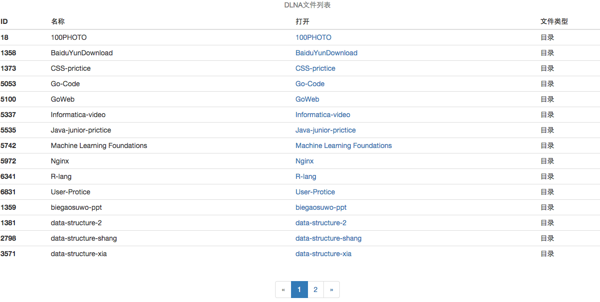
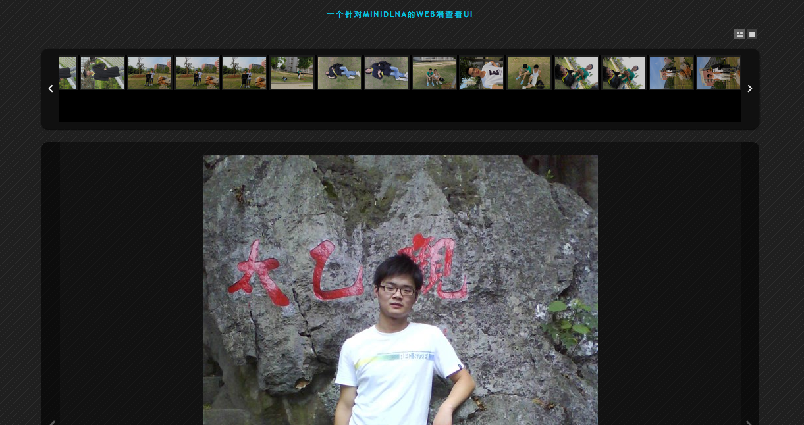

# DlnaWenUI
采用java写的一个dlna的web端，可以通过浏览器查看minidlna服务下的文件和视频。

---

## 如何发布
服务可通过tomcat或jetty进行发布，工程采用maven管理。

## 功能
访问首页是文件列表（带分页），视频播放器采用HTML5播放器，插件采用video.js，目前只能播放MP4格式。图片查看可以达到QQ相册的效果，就是幻灯片轮播图的效果。

## 注意
数据库是直接读取MiniDlna服务生成的sqlite数据库文件，一般机器发布直接采用maven下载的sqlite包即可，但由于我是把服务发布在Radxa（arm的cpu）上，因此sqlite的jdbc包需要包含读取arm的文件，因此在sqlite文件夹下放上了我自己编译的jar，如果要发布到arm上，可以使用我提供的jar。

## 为何做这个小项目？
由于一些资源都放在移动硬盘上，特别是岛国片，但每次想看的时候还得打开电脑，或者拷贝到手机上看。而我自己有个很小的服务器（Radxa或者Raspberry Pi），里面装了一些服务，因此装上MiniDlna，安装可参考地址：<http://www.2fz1.com/post/raspberry-pi-minidlna-nas-ipad/>   
之后发布这个小项目，就可以直接在浏览器里看图片和视频。

## 使用的技术
前端采用bootstrap + video.js，后端采用jdbsTemplate封装简单查询sql。

## 界面截图
文件列表页面

图片查看

视频查看

